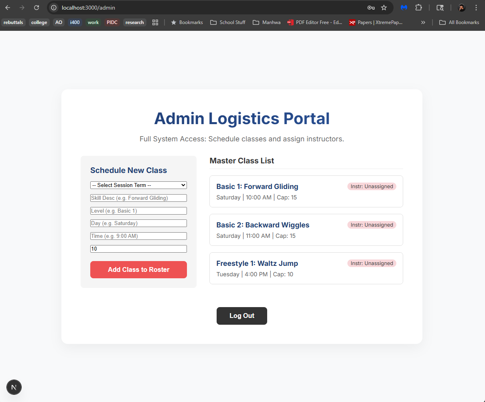

# Skating School Administration

**Developed in the class I400-Vibe and AI Programming, Spring 2026, IUB, with the assistance of models (gemini/codex/Claude) within (antigravity/cursor/lovable).**

## Demonstration Video

*(Note: Replace the placeholders in the `docs` folder with your actual thumbnail and video file!)*

## Deployment Instructions (Vercel)

Although this MVP is engineered to run locally, it is fully production-ready for the edge network.
1. Push this repository to your GitHub account.
2. Log into [Vercel.com](https://vercel.com).
3. Click **Add New Project** and import your Skating School GitHub repository.
4. Open the **Environment Variables** panel in Vercel.
5. Add `NEXT_PUBLIC_SUPABASE_URL` and `NEXT_PUBLIC_SUPABASE_ANON_KEY` matching your `.env.local` file.
6. Click **Deploy**. Vercel will automatically build the Next.js framework and host it live.

## Local Setup

If running locally:
1. Copy `.env.example` to `.env.local` and add your keys.
2. Run `npm install`.
3. Run `npm run dev`.
